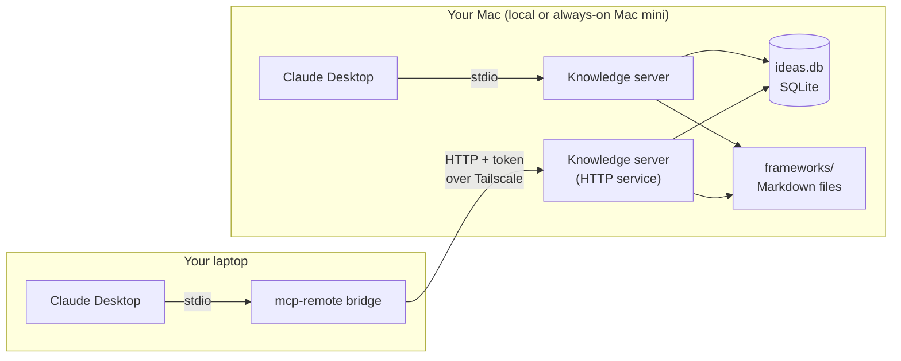

# Practitioner Knowledge MCP

**A personal knowledge base for Claude, built for practitioners, not programmers.**

[](LICENSE)
[](https://github.com/econmatrix007/practitioner-knowledge-mcp/actions/workflows/ci.yml)
[](https://www.python.org/)
[](https://modelcontextprotocol.io/)

## Why this exists

Chat sessions forget. Your best ideas and the methods you use to test them end
up scattered across notes, slide decks, and old conversations. Each new chat
starts from zero.

The Model Context Protocol (MCP) lets Claude read from and write to a store
that you own, on a machine you control. You keep the knowledge; Claude gets a
memory it can search.

Most MCP templates assume a software engineer. This one assumes a domain
expert: an economist, a planner, a policy analyst, a consultant. Every step
says what to type, where to type it, and what you should see.

## What you get

**Eight tools** that Claude can call:

| Tool | What it does |
|---|---|
| `store_idea` | Saves an idea: the problem it addresses, your insight, and the assumptions it rests on |
| `get_idea` | Shows one idea in full |
| `update_idea` | Changes any part of an idea as your thinking matures |
| `search_ideas` | Full-text search across everything, best match first |
| `list_ideas` | Browses ideas by domain, tag, or status |
| `idea_stats` | Counts by domain and status, and your most used tags |
| `list_frameworks` | Lists your reusable analytical methods |
| `get_framework` | Brings one method into the conversation |

**Two ways to run it:**

- **Local.** Claude Desktop starts the server on your Mac when it opens.
- **Always on.** A Mac mini serves one knowledge base to every device you own,
  over a private Tailscale network.

**Your data in one file.** Ideas live in a single SQLite database on your Mac.
Frameworks are plain Markdown files you edit in any text editor and keep in git.

## Who it is for

**For:** economists, planners, policy analysts, consultants, researchers,
writers, and anyone whose work runs on ideas and methods that build over years.

**Not for:**

- Teams. It has one user and no accounts or permissions.
- Hosted services. It is not built to run in the cloud for others.
- Anything that needs to be reachable from the public internet. It is designed
  to stay private.

## How it works



Claude Desktop starts the knowledge server and talks to it directly, with no
network involved. On an always-on Mac mini, the same server also runs as a
background service that other devices reach through Tailscale, a private
network of your own machines. Both paths read and write the same database file.

## Quickstart (about 15 minutes)

This is the short version. The full guide, with a fix for every common
problem, is [docs/01-quickstart-local.md](docs/01-quickstart-local.md).

### Prerequisites

Open Terminal (Applications, then Utilities) and check each one:

| Need | Check | Expected |
|---|---|---|
| A current macOS | `sw_vers -productVersion` | A version number, such as `15.6` |
| git | `git --version` | `git version 2.x` (if macOS offers to install developer tools, accept) |
| uv | `uv --version` | `uv 0.8` or newer |
| Claude Desktop | Open it | You can start a chat |

No uv? Install it, then open a new Terminal window:

```bash
curl -LsSf https://astral.sh/uv/install.sh | sh
```

You do not need to install Python. uv installs the right version for this
project and keeps it separate from anything else on your Mac.

### Install

```bash
mkdir -p ~/dev && cd ~/dev
git clone https://github.com/econmatrix007/practitioner-knowledge-mcp.git
cd practitioner-knowledge-mcp
make install
```

Expected, at the end:

```
Resolved 48 packages in 20ms
Installed 45 packages in 1.2s
```

### Create the database and add sample ideas

```bash
make init-db
make seed
```

Expected:

```
Database ready: /Users/you/.knowledge-mcp/ideas.db
Schema version: 1. Ideas stored: 0.
...
Inserted: 12. Skipped (already present): 0.
Ideas stored: 12.
```

The 12 sample ideas are fictional, across four subjects: urban systems, supply
chains, public finance, and strategy.

### Test it

```bash
make smoke
```

This starts the server the way Claude Desktop will and calls every read-only
tool. Expected, at the end:

```
  PASS  database                   12 ideas

12 passed, 0 failed.
```

Optional: `make inspect` opens MCP Inspector in your browser so you can click
through the tools by hand. It needs Node.js (`brew install node`). If the first
connection times out, click Retry.

## Connect to Claude Desktop

Claude Desktop keeps its list of servers in
`~/Library/Application Support/Claude/claude_desktop_config.json`. The entry
for this server looks like
[examples/claude_desktop_config.stdio.json](examples/claude_desktop_config.stdio.json):

```json
{
  "mcpServers": {
    "practitioner-knowledge": {
      "command": "/Users/you/.local/bin/uv",
      "args": ["--directory", "/Users/you/dev/practitioner-knowledge-mcp",
               "run", "knowledge-mcp", "--transport", "stdio"],
      "env": { "KNOWLEDGE_MCP_DB": "/Users/you/.knowledge-mcp/ideas.db" }
    }
  }
}
```

Quit Claude Desktop with **Cmd-Q** first: an open Claude Desktop can write its
own copy of the file back and drop your change. Then use the one-paste command in
[docs/02-connect-claude-desktop.md](docs/02-connect-claude-desktop.md). It adds
this entry for you, fills in your paths, keeps any servers you already have, and
backs up the file first.

Reopen Claude Desktop. In a regular new chat, ask:

> Use practitioner-knowledge to search my ideas for supply chain.

A correct answer describes three sample ideas: supplier lead-time variance,
inventory buffers at the chokepoint, and dual sourcing as insurance. If Claude
Desktop reports a timeout the very first time, click Retry; uv was still
setting up.

## Make it yours

**Clear out the samples.** Archive them, so they stay out of your way:

> Use practitioner-knowledge to set the status of ideas 1 through 12 to archived.

Or start a fresh database: quit Claude Desktop, move
`~/.knowledge-mcp/ideas.db` to a backup folder, and run `make init-db`.

**Choose your domains and tags.** There is no fixed list. A domain is the field
an idea belongs to (`public finance`); tags cut across fields (`incentives`,
`measurement`). Pick a few domains you return to often and stay consistent.
Ask for `idea_stats` now and then to see what you actually use.

**Use the structure.** Every idea has a problem (the puzzle), an insight (your
answer or mechanism), and optional assumptions (what must hold for it to work).
Writing the assumptions down is what makes an idea testable later.

**Write your own frameworks.** Copy one of the three samples in `frameworks/`
and edit it. Claude can use it immediately. See
[docs/06-write-your-own-frameworks.md](docs/06-write-your-own-frameworks.md).

**Add a custom tool.** A plugin is one Python file of about 20 lines, loaded
without touching the project's code. See
[docs/05-add-your-own-tools.md](docs/05-add-your-own-tools.md).

## Optional: an always-on Mac mini

**Why bother:** one database that every device reads and writes, available
even when your laptop is asleep or traveling. Two copies on two laptops drift
apart; one copy on one host does not.

On the Mini, after the Quickstart:

```bash
sudo pmset -a sleep 0                            # never sleep
sudo pmset -a autorestart 1                      # restart after a power failure
deploy/macos/install_launchd.sh install server   # install the background service
curl -s http://127.0.0.1:8765/healthz            # check it
```

Expected from the last two:

```
Created token: /Users/you/.knowledge-mcp/token (readable only by you)
Installed /Users/you/Library/LaunchAgents/com.example.knowledge-mcp.plist
Server is up: http://127.0.0.1:8765/healthz
{"status":"ok"}
```

The service starts when you log in and restarts itself within seconds if it
stops. It requires an access token, kept in a file only you can read. The full
guide, including what happens after a power cut, is
[docs/03-always-on-mac-mini.md](docs/03-always-on-mac-mini.md).

## Optional: reach it from your laptop

[Tailscale](https://tailscale.com) connects your devices in a private,
encrypted network, wherever they are. The Mini's service listens only on its
Tailscale address, so nothing outside your own devices can reach it.

Claude Desktop on the laptop connects through **mcp-remote**, a small bridge
that turns Claude Desktop's local connection into an HTTP request and adds your
token from a private file. The entry looks like
[examples/claude_desktop_config.remote.json](examples/claude_desktop_config.remote.json):

```json
"practitioner-knowledge": {
  "command": "/opt/homebrew/bin/npx",
  "args": ["-y", "mcp-remote@0.14.3", "http://100.101.102.103:8765/mcp",
           "--transport", "http-only", "--allow-http",
           "--header-file", "/Users/you/.knowledge-mcp/remote-headers"]
}
```

[docs/04-remote-access-tailscale.md](docs/04-remote-access-tailscale.md) walks
through it in eight steps, with a check after each one.

## Lessons learned from running this daily

- **Keep one database on one host.** Two copies on two machines will drift,
  and merging them later costs real time.
- **Pin releases on the always-on host.** Build and test a new version on
  another Mac first. The service runs only what you installed and never
  upgrades itself.
- **Back up before every upgrade** with `scripts/backup_db.sh`, and put the
  host on a UPS. A power cut in the middle of a write is the most likely way
  to damage the database.
- **Frameworks belong in git; ideas belong in the database.** Methods change
  slowly and deserve history. Ideas grow one conversation at a time.

## Security: read before you run it

- **It binds to localhost by default.** The HTTP service listens only on
  `127.0.0.1` unless you choose otherwise. It refuses `0.0.0.0`, and it refuses
  any non-local address without an access token.
- **Never expose it to the public internet.** Use Tailscale for remote access.
  Do not forward router ports to it or publish it with Tailscale Funnel.
- **MCP servers can be a prompt-injection path.** Whatever Claude reads through
  a tool, including a framework someone sent you, can contain instructions.
  Only connect tools you trust, read frameworks before adding them, and approve
  write tools one call at a time.
- **No telemetry.** The project collects no usage data, sends nothing to the
  maintainer, and makes only the read-only version checks listed below. Those
  checks run only in the maintenance checkup, when you run or schedule it:
  package versions from the PyPI JSON API, this project's releases from the
  GitHub releases API, Python releases from python.org, and known
  vulnerabilities through `pip-audit`.
- **Keep private material out of any fork you publish.** List private names in
  `.private-terms.txt`; `scripts/check_private.sh` scans every file and the
  full git history for them.

Details: [docs/08-security.md](docs/08-security.md). To report a
vulnerability, see [SECURITY.md](SECURITY.md).

## FAQ

**Does it work on Windows?** Not officially. The server is plain Python, but
the setup scripts and the always-on service are macOS only.

**Can I use other AI apps?** Yes, any app that supports MCP servers over stdio
or Streamable HTTP, such as Claude Code.

**Does my data leave my Mac?** The database does not. But anything Claude
reads through a tool becomes part of your conversation with Claude, under your
Claude plan's privacy terms.

**Can I import existing notes?** Not with a built-in command yet. Paste notes
into a chat and ask Claude to store them, or write a short import script.

**How big can it get?** Titles up to 200 characters, text fields up to 20,000,
and 20 tags per idea. SQLite handles millions of ideas.

**Is it encrypted?** Turn on FileVault to encrypt the disk. Remote traffic runs
inside Tailscale's encryption.

**Can I sync the database across Macs?** Do not sync the live file through
iCloud or Dropbox. Keep one always-on host and connect to it.

More: [docs/faq.md](docs/faq.md).

## Roadmap

- Import ideas from Markdown or CSV files
- A tool to rename and merge tags
- Optional semantic search with embeddings, alongside full-text search
- Export ideas to Markdown

## Contributing

Small, focused pull requests are welcome. Please read
[CONTRIBUTING.md](CONTRIBUTING.md) first. Run `make check` before you open a
pull request; it runs the tests, the linter, and the secret scan. For setup
questions, use the setup help issue template rather than a bug report.

## Support this project

If this kit saves you time, you can sponsor its upkeep through
[GitHub Sponsors](https://github.com/sponsors/econmatrix007). Sponsorships are not
tax-deductible donations, and they do not buy support or change its terms:
help is best effort, as described in [SUPPORT.md](SUPPORT.md).

## License, acknowledgments, disclaimer

Created and maintained by ArtemisLogic. Licensed under the
[Apache License 2.0](LICENSE).

Built on the [Model Context Protocol](https://modelcontextprotocol.io) and its
official Python SDK, with [uv](https://docs.astral.sh/uv/),
[SQLite](https://sqlite.org), and [Tailscale](https://tailscale.com).

Provided as is, without warranty of any kind. You are responsible for your own
data and backups.
